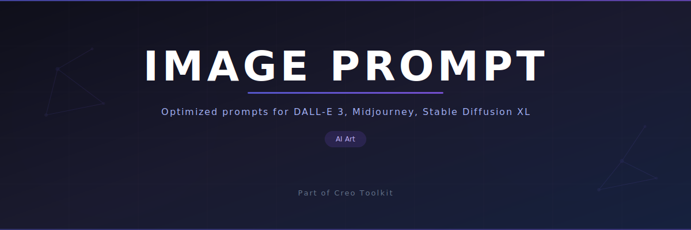

<p align="center"></p>

# claude-image-prompt

AI image prompt generation skill for Claude Code -- optimized prompts for DALL-E 3, Midjourney, and Stable Diffusion XL.

[](https://github.com/creo-kit/claude-image-prompt)
[](LICENSE)

---

## What It Does

- **Generates optimized image prompts** -- creates detailed, contextually appropriate prompts tailored for AI image generation models
- **Supports multiple AI models** -- works with DALL-E 3, Midjourney, Stable Diffusion XL, Flux, Ideogram, and Leonardo AI
- **Style, composition, and lighting parameters** -- follows a professional visual style guide covering lighting, setting, color palette, and subject direction
- **Batch generation** -- generate all image prompts for an entire site in one pass (hero, card, thumbnail, OG image, mobile hero)

## Install

```bash
curl -fsSL https://raw.githubusercontent.com/creo-kit/claude-image-prompt/main/install.sh | bash
```

Or clone manually:

```bash
git clone --depth 1 https://github.com/creo-kit/claude-image-prompt.git ~/.claude/skills/creo-image-prompt
```

## Usage

```
/creo image-prompt <context>
```

### Commands

| Command | Description |
|---------|-------------|
| `/creo image-prompt hero` | Generate hero image prompts for pages |
| `/creo image-prompt feature` | Generate feature/card image prompts |
| `/creo image-prompt batch` | Generate all image prompts for the site |

### Example

```
/creo image-prompt hero
```

The skill reads your page content (locale files, content config, markdown) and generates prompts structured by page and image type:

```javascript
const CONTEXT_AWARE_PROMPTS = {
  landing: {
    hero: `Modern co-working space with natural light...`,
    ogImage: `Wide shot of professional workspace...`,
    heroMobile: `Vertical composition of developer at desk...`,
  },
  features: {
    analytics: {
      hero: `Data visualization on modern monitor...`,
      card: `Close-up of dashboard interface...`,
    },
  },
};
```

## Supported Image Types

| Type | Aspect Ratio | Use Case |
|------|-------------|----------|
| `hero` | 16:9 landscape | Main page headers |
| `card` | 4:3 or 1:1 | Feature and listing cards |
| `thumbnail` | 1:1 square | Small previews |
| `ogImage` | 1200x630 | Social media sharing |
| `heroMobile` | 9:16 portrait | Mobile hero sections |

## Part of Creo

This skill is a standalone extract from [Creo](https://github.com/oyusypenko/creo), an AI-powered design, UX, content, and DevOps toolkit for Claude Code. Browse the full toolkit for design reviews, SEO auditing, marketing content generation, CI/CD pipelines, and more.

## Compatibility

Works with AI coding assistants that support the Claude Code skill format:

- [Claude Code](https://docs.anthropic.com/en/docs/claude-code)
- [Codex CLI](https://github.com/openai/codex)
- [Cursor](https://cursor.sh)
- [Gemini CLI](https://github.com/google-gemini/gemini-cli)

## License

[MIT](LICENSE)
